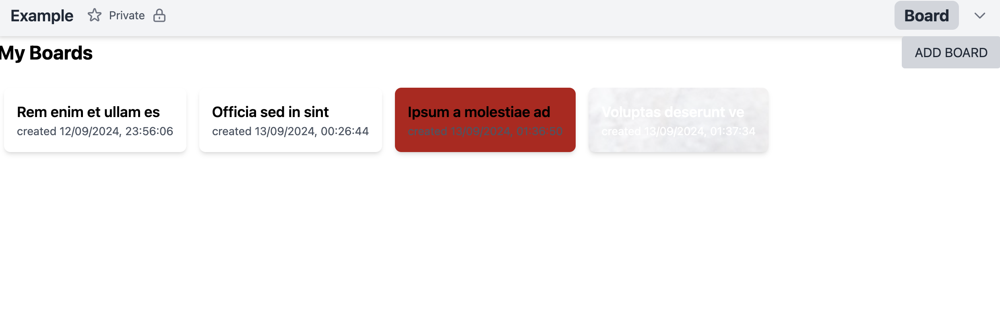
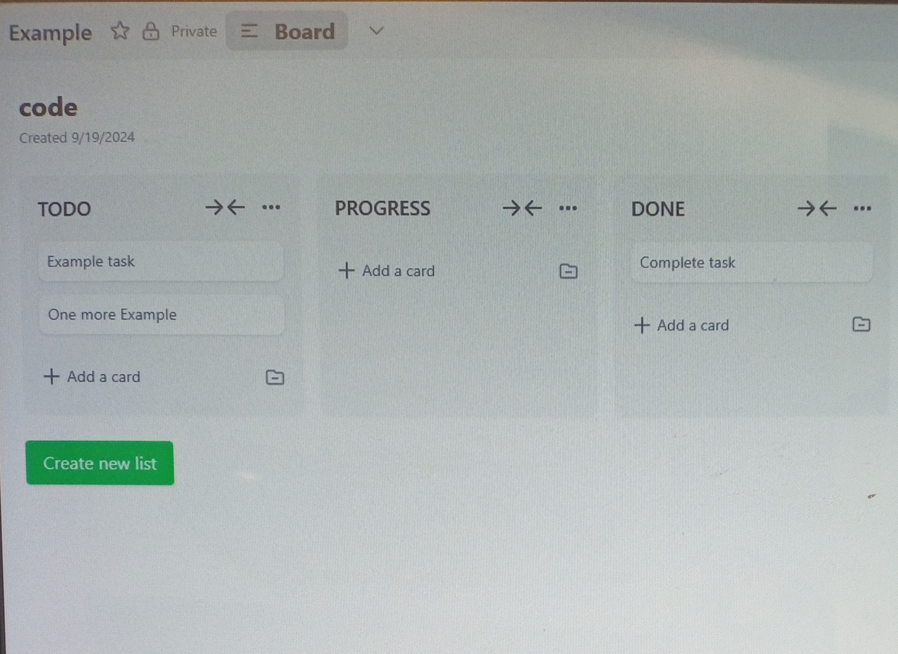

# Trello Clone

# Getting Started:
To get a local copy up and running follow these simple example steps:

Under the repository name, click the Clone or download green button.

Copy the URL given by clicking the clipboard button.

Open a terminal window in your local machine and change the current directory to the one you want the clone directory to be made.

Type git clone and then paste the URL you previously copied to the clipboard.

Open a new terminal window in your local machine and change the current directory to your cloned directory.

Run npm install / yarn install from the Terminal.

after that npm run dev or yarn dev from the terminal.

# Images 




```bash
## Development Server

Start the development server on `http://localhost:3000`:


## Production

Build the application for production:

```bash
# npm
npm run build

# pnpm
pnpm run build

# yarn
yarn build

```


